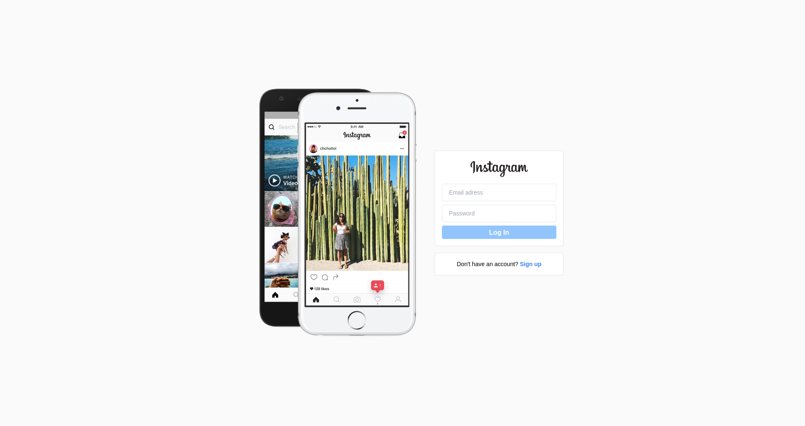
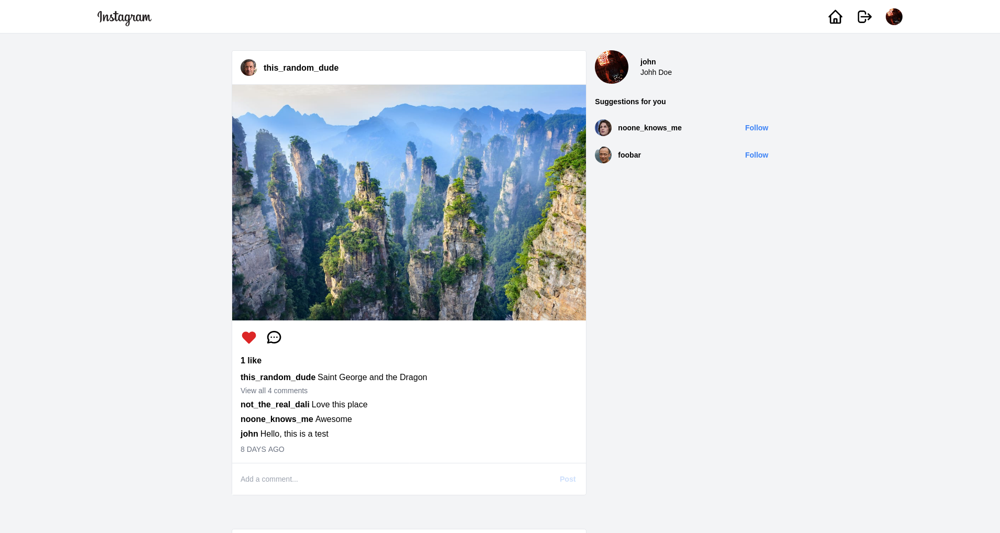
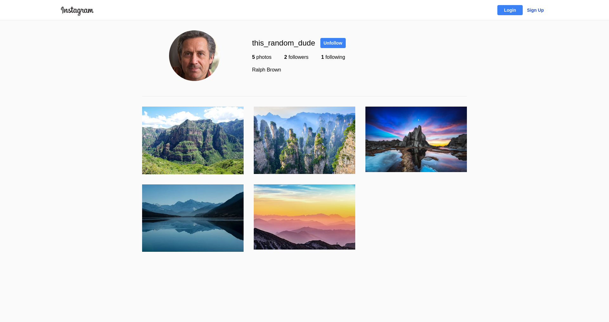

# Instagram Clone
This is an Instagram clone app that was built using React, React Router and Firebase.

## Author

**[Bernardo Garza Landa](https://bernardogarza.me/)** - bernardo.g.landa@gmail.com - [Portfolio](https://bernardogarza.me) - [LinkedIn](https://www.linkedin.com/in/bernardo-g-landa/)

## Live Demo

<a href="https://instagram-clone-bg.netlify.app/" target="_blank">https://instagram-clone-bg.netlify.app/</a>

 
 

<h1 align="center">Screenshots</h1>

  

  

  

 
 

## Available Scripts

In the project directory, you can run:

### `yarn start`

Runs the app in the development mode.\
Open [http://localhost:3000](http://localhost:3000) to view it in the browser.

The page will reload if you make edits.\
You will also see any lint errors in the console.
